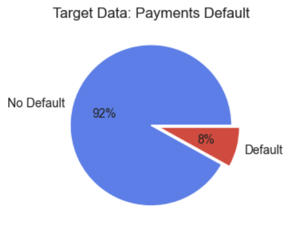
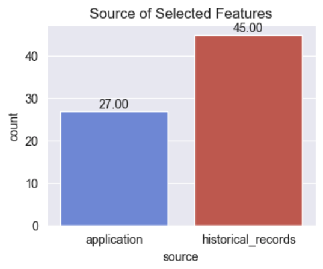

## Home Credit Default Risk Prediction Business Report
(This readme file is intended to be a business report for Home Credit Group)

#### Overview
Home Credit is an international non-bank financial institution specializing in installment lending, primarily to individuals with little or no credit history. Instead of relying on credit history, Home Credit assesses loan applications using data such as basic applicant information, sociogeographical details, and the completeness of the loan application.

In this project, we have access to both loan application data and the applicants' past loan histories and bureau credit histories. Our objective is to develop models that predict whether a client will default on a current loan. Additionally, we will explore if models that incorporate historical and application data perform better than those using only application data.

Ultimately, we will recommend the most suitable model, supported by sound reasoning to our potential clients. This model will also be deployed to Google Cloud Platform (GCP) for further use.

#### Data Processing

Given the diverse data sources, it is essential to integrate and extract information from them for comprehensive analysis.

##### Data Processing Steps
1. Aggregate the previous loan records tables (installment, POS cash, credit card) by previous_loan_id and generate new features.
2. Join these tables with the previous_loan_application table.
3. Aggregate the current loan data by current_loan_id and pivot on different loan types (cash, consumer, revolving) to create the all_historical_feats table.
4. Aggregate and join the bureau and bureau_balance tables.
Join the aggregated bureau table with the application table on current_loan_id.
5. Join the application_bureau table with the all_historical_feats table to create app_full table which includes all features.
6. Feature selection with model.

##### Processing diagram

#### Data Overview

- The data is highly imbalanced, suitable balancing strategy should be applied.

#### Models and metrics

##### 5 Candidate models and balance strategy:

Compared with Base Model, LGBM trained only on application data.

- LGBM (class_weight)
- LGBM + Balanced RandomForest
- Logistic Regression (class_weight)
- Balanced RandomForest
- LGBM + SMOTE (over sampling)

 
 

> LGBM and LGBM + Balanced RandomForest are the most performant models.
- __LGBM__: Both the recall of positive and negative classes are slightly better than Base model.
- __LGBM + Balanced RandomForest__: recall of positive class is 6% worse than Base model, but the recall for negative class is 8% better than the base model.

##### Feature Importance

> In the LGBM + Balanced RandomForest model, application related features have higher importance, while in LGBM, the importance of application and historical features are more balanced.

##### Error Analysis
Both models have their own strength, what are the trade-offs preferring one over another ? Let's look at the prediction error (FP, FN) on one feature that impacts the financial institution/ banks most directly: `Loan amount credit`.

False_Positive
- LGBM is more strict in identifying positive class, the median and mean of LGBM is 20,000 higher than the LGBM + Balanced RandomForest model. It has higher chance to falsely predict default on people who apply for bigger loans.

> This is not ideal for our use case, since banks can earn more interest from bigger loans, they would earn less if more of the bigger loans are rejected.

False_Negative
- The mean and median of both models are very similar for the loans that are falsely predicted as default.

> Despite of being more tolerant, LGBM + Balanced RandomForest model is not falsely predicting big loan_amt to not_default, but the ones similar to LGBM model.

#### 🏦 Final Decision 🏦

Based on our analysis I would recommend ` LGBM + Balanced_RF` model for several reasons:

1. Application related features have higher importance in this model. Since Home Credit Group is mainly offering loans to people with little credit history, a model that uses less historical credit features would be more robust and create less bias across a mixed group of clients in which majority of them have little credit history.

2. Although the model identifies less loan_default, the ones it miss have no bigger loan amount than the ones missed by LGBM. This implies that unreasonably big loans or people with bad records are still captured (marked as default). 

3. The model is more tolerant, it successfully predicts almost 10% more loans to non-default, keeping in mind that 92% of applicants are non defaulters, this is a considerably big group of people. Based on this, banks can thus provide service to more people and earn interest from them.

#### Model Deployment

LGBM + Balanced RandomForest Model is deployed to GCP, try it out on the `prediction_demo.ipynb` notebook.

---

Notebooks: 
- [1_app_df_cleaning](https://github.com/TuringCollegeSubmissions/mchien-ML.4.1/blob/master/1_clean_app_df.ipynb)
- [2_supporting_df_cleaning](https://github.com/TuringCollegeSubmissions/mchien-ML.4.1/blob/master/2_clean_supporting_dfs.ipynb)
- [3_join_and_aggregate_tables](https://github.com/TuringCollegeSubmissions/mchien-ML.4.1/blob/master/3_join_and_agg_dfs.ipynb)
- [4_eda](https://github.com/TuringCollegeSubmissions/mchien-ML.4.1/blob/master/4_eda.ipynb)
- [5_modeling](https://github.com/TuringCollegeSubmissions/mchien-ML.4.1/blob/master/5_modeling.ipynb)

Deployment Folder:
- [model deployment](https://github.com/TuringCollegeSubmissions/mchien-ML.4.1/tree/master/loan_default_prediction_app)

Test cloud deployment:
- [prediction demo file](https://github.com/TuringCollegeSubmissions/mchien-ML.4.1/blob/master/prediction_demo.ipynb)

