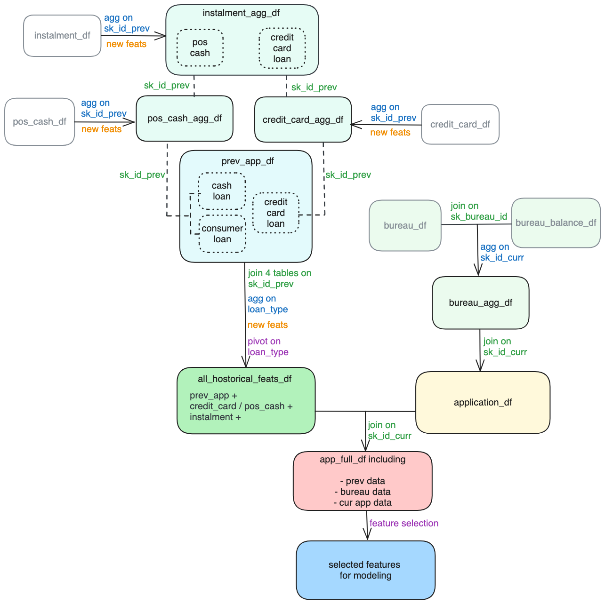
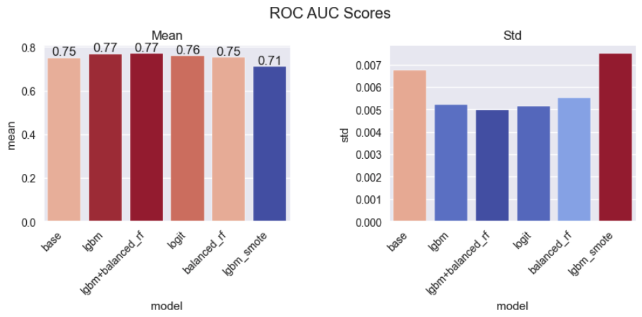
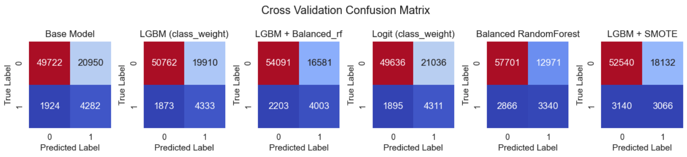
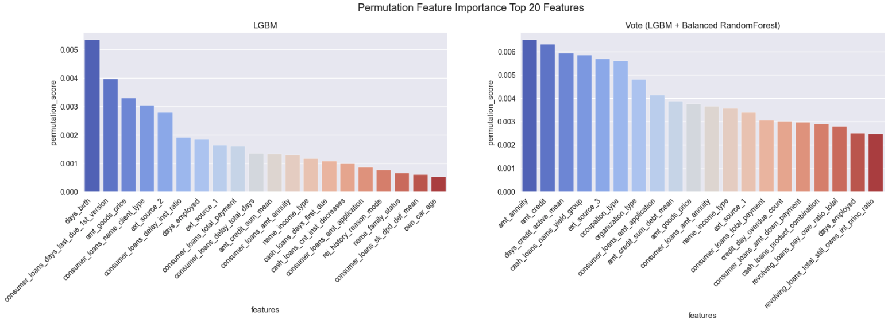
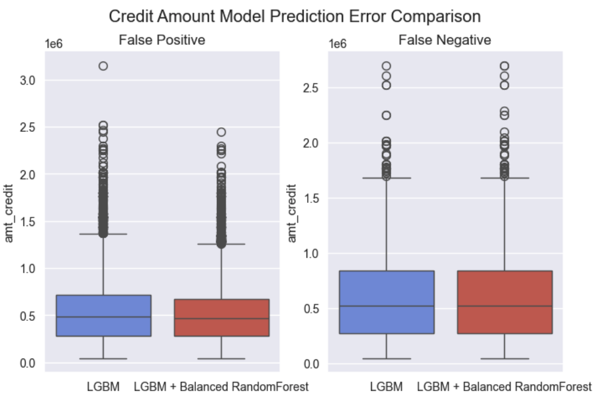
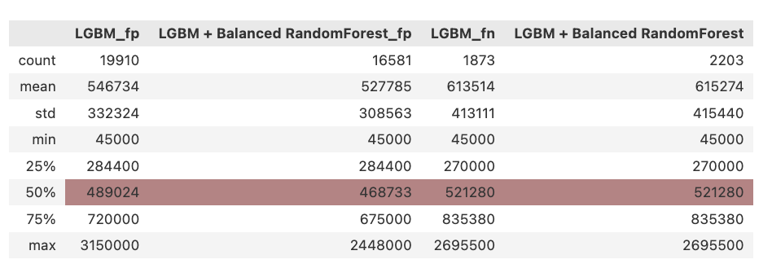

# Home Credit Default Risk Prediction Business Report
(This readme file is intended to be a business report for Home Credit Group)

## Overview
Home Credit is an international non-bank financial institution specializing in installment lending, primarily to individuals with little or no credit history. Instead of relying on credit history, Home Credit assesses loan applications using data such as basic applicant information, sociogeographical details, and the completeness of the loan application.

In this project, we have access to both loan application data and the applicants' past loan histories and bureau credit histories. Our objective is to develop models that predict whether a client will default on a current loan. Additionally, we will explore if models that incorporate historical and application data perform better than those using only application data.

Ultimately, we will recommend the most suitable model, supported by sound reasoning to our potential clients. This model will also be deployed to Google Cloud Platform (GCP) for further use.

## Data Processing

Given the diverse data sources, it is essential to integrate and extract information from them for comprehensive analysis.

1. Aggregate the previous loan records tables (installment, POS cash, credit card) by previous_loan_id and generate new features.
2. Join these tables with the previous_loan_application table.
3. Aggregate the current loan data by current_loan_id and pivot on different loan types (cash, consumer, revolving) to create the all_historical_feats table.
4. Aggregate and join the bureau and bureau_balance tables.
Join the aggregated bureau table with the application table on current_loan_id.
1. Join the application_bureau table with the all_historical_feats table to create app_full table which includes all features.
2. Feature selection with model.

## Results

Since the target (loan_default) is highly imbalanced, different balancing strategies are applied to the models.

- LGBM (class_weight)
- LGBM + Balanced RandomForest
- Logistic Regression (class_weight)
- Balanced RandomForest
- LGBM + SMOTE (over sampling)

 
 

> `LGBM` and `LGBM + Balanced RandomForest` are the most performant models.

| Model                   | ROC AUC | Accuracy | Recall | Precision |
|-------------------------|---------|----------|--------|-----------|
| Base Model              | 0.75    | 0.713    | 0.690  | 0.170     |
| LGBM (class_weight)     | 0.77    | 0.725    | 0.698  | 0.179     |
| LGBM + Balanced RF      | 0.77    | 0.750    | 0.645  | 0.194     |

> `LGBM + Balanced RandomForest` is more balanced than `LGBM` in terms of recall and precision.

### Comparing the Two Most Performant Models: LGBM and LGBM + Balanced RandomForest

#### Feature Importance Comparison

> In the LGBM + Balanced RandomForest model, `application` related features have higher importance, while in LGBM, the importance of application and historical features are more balanced.

#### Trade-offs Analysis
To better understand the trade-offs between these models, let's analyze their prediction errors (False Positives and False Negatives) focusing on `Loan amount credit` - a key metric that directly affects financial institutions' bottom line.

__False Positive Analysis__
- The LGBM model demonstrates higher stringency in positive class identification, with its median and mean values exceeding those of the LGBM + Balanced RandomForest model by approximately 20,000 units. This indicates an increased tendency to incorrectly classify larger loan applications as defaults.

> This characteristic presents a suboptimal outcome for financial institutions, as it potentially reduces revenue opportunities from higher-value loans that typically generate greater interest income.

__False Negative Analysis__
- Both models exhibit comparable mean and median values for loans incorrectly classified as non-defaults, suggesting similar performance in this aspect.

> While the LGBM + Balanced RandomForest model demonstrates greater overall tolerance, it maintains consistent accuracy with the LGBM model in identifying high-risk loans, particularly for larger loan amounts.

### Model Recommendation and Justification

Compared to the LGBM model, the LGBM + Balanced RandomForest model is recommended for implementation due to the following key factors:

1. __Enhanced Feature Relevance__: The model places greater emphasis on application-related features, which aligns with Home Credit Group's primary demographic of clients with limited credit history. This characteristic reduces potential bias and improves model robustness across diverse client segments, particularly benefiting those without extensive credit records.

2. __Effective Risk Management__: While the model identifies 5% less loan defaults overall, its detection capability for high-risk loans remains comparable to the standard LGBM model. The consistency in identifying defaults for larger loan amounts demonstrates maintained effectiveness in risk assessment for significant financial exposures.

3. __Improved Business Opportunity__: The model exhibits superior performance in identifying non-default cases, with approximately 10% higher accuracy in this category. Given that 92% of applicants are non-defaulters, this improvement represents a significant opportunity for portfolio expansion while maintaining acceptable risk levels. This enables financial institutions to extend services to a broader client base while generating additional interest revenue.

## Model Deployment

LGBM + Balanced RandomForest Model is deployed to GCP, try it out on the `prediction_demo.ipynb` notebook.

---

Notebooks: 
- [1_app_df_cleaning](https://github.com/MeiChieh/home-credit-group-loan-default-prediction/blob/main/1_clean_app_df.ipynb)
- [2_supporting_df_cleaning](https://github.com/MeiChieh/home-credit-group-loan-default-prediction/blob/main/2_clean_supporting_dfs.ipynb)
- [3_join_and_aggregate_tables](https://github.com/MeiChieh/home-credit-group-loan-default-prediction/blob/main/3_join_and_agg_dfs.ipynb)
- [4_eda](https://github.com/MeiChieh/home-credit-group-loan-default-prediction/blob/main/4_eda.ipynb)
- [5_modeling](https://github.com/MeiChieh/home-credit-group-loan-default-prediction/blob/main/5_modeling.ipynb)

Deployment Folder:
- [model deployment](https://github.com/MeiChieh/home-credit-group-loan-default-prediction/tree/main/loan_default_prediction_app)

Test cloud deployment:
- [prediction demo file](https://github.com/MeiChieh/home-credit-group-loan-default-prediction/blob/main/prediction_demo.ipynb)

